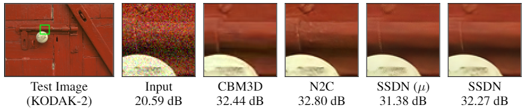

# High-Quality Self-Supervised Deep Image Denoising - Unofficial PyTorch implementation of the NeurIPS 2019 paper
Reimplementers:
**David Jones**, **Richard Crosland**, **Jason Barrett** | University of Southampton [ECS]

Codebase for the reimplmentation of the focus [paper](https://arxiv.org/abs/1901.10277) as well as discussed baselines: Noise2Clean, [Noise2Noise](https://arxiv.org/abs/1803.04189), and [Noise2Void](https://arxiv.org/abs/1811.10980).



## Resources

- [Original Paper](https://arxiv.org/abs/1901.10277) (arXiv)
- [Official Tensorflow Source](https://github.com/NVlabs/selfsupervised-denoising) (GitHub)

## Python requirements
This code was tested on:
- Python 3.7
- [PyTorch](https://pytorch.org/get-started/locally/) 1.4.0 [Cuda 10.0 / CPU]
- [Anaconda 2020/02](https://www.anaconda.com/distribution/)

## Installation
1. Create an Anaconda/venv environment (Optional)
2. Install PyTorch
3. Install SSDN package and dependencies: ```pip install -e ssdn```


## Preparing datasets
Dataset download/preparation is handled using the original implementation's methods; these are provided as tools in the `external` directory. Dataloading methods expect either a hdf5 file format or a folder dataset. Networks expect to train with a fixed patch size and inputs are padded or randomly cropped to reach this patch size. The dataset can be filtered to contain only images between 256x256 and 512x512 pixels using `dataset_tool_h5.py`. The original paper's and this paper's trained networks use this tool on the ImageNet validation set to create the training set.
To generate the training data hdf5 file, run:
```
python dataset_tool_h5.py --input-dir "<path_to_imagenet>/ILSVRC2012_img_val" --out=ilsvrc_val.h5
```

A successful run of dataset_tool_h5.py should result in a `.h5` file containing 44328 images.

### Validation datasets used:

**Kodak**.  To download the [Kodak Lossless True Color Image Suite](http://r0k.us/graphics/kodak/), run:
```
python download_kodak.py --output-dir={output_dir}/kodak
```

**BSD300**.  From [Berkeley Segmentation Dataset and Benchmark](https://www2.eecs.berkeley.edu/Research/Projects/CS/vision/bsds) download `BSDS300-images.tgz` and extract.

**Set14**.  From [LapSRN project page](http://vllab.ucmerced.edu/wlai24/LapSRN) download `SR_testing_datasets.zip` and extract.


## Running
The denoiser is exposed as a CLI accessible via the ```ssdn``` command.

### Training:
To train a network, run:
```
ssdn train start [-h] --train_dataset TRAIN_DATASET
                        [--validation_dataset VALIDATION_DATASET] --iterations
                        ITERATIONS [--eval_interval EVAL_INTERVAL]
                        [--checkpoint_interval CHECKPOINT_INTERVAL]
                        [--print_interval PRINT_INTERVAL]
                        [--train_batch_size TRAIN_BATCH_SIZE]
                        [--validation_batch_size VALIDATION_BATCH_SIZE]
                        [--patch_size PATCH_SIZE] --algorithm
                        {n2c,n2n,n2v,ssdn,ssdn_u_only} --noise_style
                        NOISE_STYLE [--noise_value {known,const,var}] [--mono]
                        [--diagonal] [--runs_dir RUNS_DIR]

The following arguments are required: --train_dataset/-t, --iterations/-i, --algorithm/-a, --noise_style/-n
```
Note that the validation dataset is optional, this can be ommitted but may be helpful to monitor convergence. Where a parameter is not provided the default in `cfg.py` will be used.

---

Training will create model checkpoints that contain the training state at specified intervals (`.training` files). When training completes a final output is created containing only network weights and the configuration used to create it (`.wt` file). The latest training file for a run can be resumed using:
```
ssdn train resume [-h] [--train_dataset TRAIN_DATASET]
                         [--validation_dataset VALIDATION_DATASET]
                         [--iterations ITERATIONS]
                         [--eval_interval EVAL_INTERVAL]
                         [--checkpoint_interval CHECKPOINT_INTERVAL]
                         [--print_interval PRINT_INTERVAL]
                         [--train_batch_size TRAIN_BATCH_SIZE]
                         [--validation_batch_size VALIDATION_BATCH_SIZE]
                         [--patch_size PATCH_SIZE]
                         run_dir
The following arguments are required: run_dir (positional)
```


---

Further options can be viewed using: `ssdn train {cmd} --help` where `{cmd}` is `start` or `resume`.

### Evaluating:
To evaluate a trained network against one of the validation sets, run:
```
ssdn eval [-h] --model MODEL --dataset DATASET [--runs_dir RUNS_DIR]
                 [--batch_size BATCH_SIZE]
The following arguments are required: --model/-m, --dataset/-d
```
---
Further options can be viewed using: `ssdn eval --help`

### Extra notes:

The network will attempt to use all available GPUs - `cuda0` being used as the master with the batch distributed across all remaining. To avoid this filter the GPUs available using:
```
CUDA_VISIBLE_DEVICES=#,#,# ssdn ...
```

---

During execution an events file is generated with all training metrics. This can be viewed using Tensorboard.

When executing remotely it may be prefable to expose this to a local machine. The suggested method to do this is `ssh`:
```
ssh -L 16006:127.0.0.1:6006 {username}@{remote}
$ tensorboard --logdir runs
# Connect locally at: http://127.0.0.1:16006/
```

